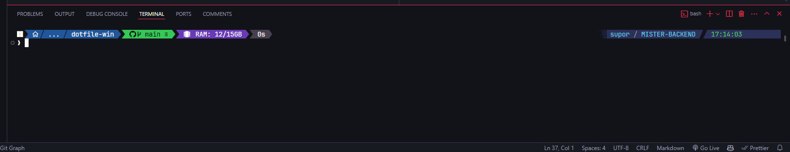

# Configuração do Terminal para Windows 11

Este repositório contém as configurações personalizadas do meu terminal para CMD, PowerShell e Bash no Windows 11, utilizando Oh My Posh e Clink.

## Meu Terminal

## Configuração

### Oh My Posh

Instale o Oh My Posh para melhorar a experiência do seu terminal com temas personalizados e funções avançadas. Para instalação, siga as instruções disponíveis em:
[Oh My Posh Installation](https://ohmyposh.dev/docs/installation/windows)

O tema utilizado é uma variação personalizada do `blue-owl`, que pode ser encontrado originalmente aqui:
[Blue Owl Theme](https://github.com/JanDeDobbeleer/oh-my-posh/blob/main/themes/blue-owl.omp.json)

O arquivo de configuração do tema está disponível neste repositório como `tgentil.omp.json`.

### Clink

Clink estende as capacidades do prompt de comando do Windows. Versão utilizada: v1.6.20.
Baixe e instale o Clink a partir do seguinte link:
[Clink v1.6.20](https://github.com/chrisant996/clink/releases/tag/v1.6.20)

### Windows Terminal Schema

O schema do Windows Terminal utilizado foi baseado em configurações encontradas no repositório do Christian Lempa. O arquivo `xcad_schema.json` contém as configurações personalizadas usadas.

Link do repositório original:
[Windows Terminal Settings](https://github.com/ChristianLempa/dotfiles-win/blob/main/windows-terminal-settings.json)

## Como Usar

Para usar as configurações deste repositório, siga os guias de instalação dos componentes listados acima e substitua os arquivos de configuração pelos presentes neste repositório.

